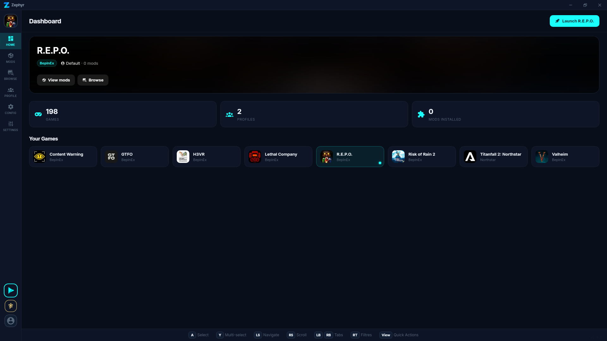
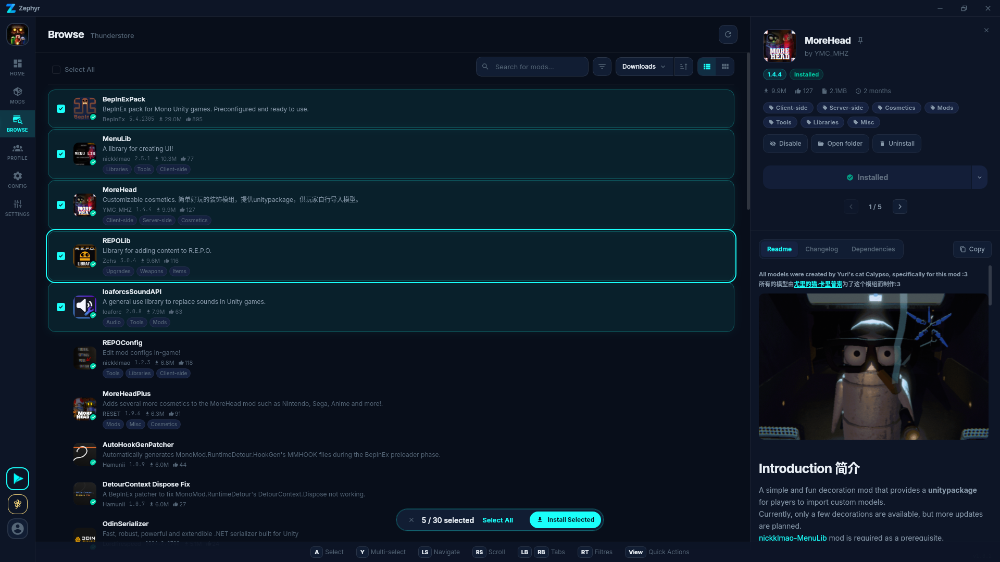
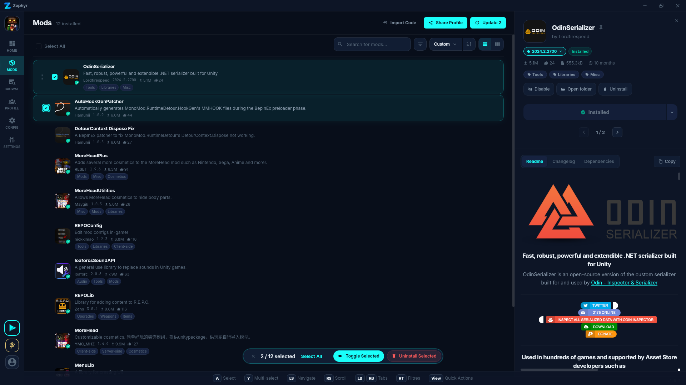
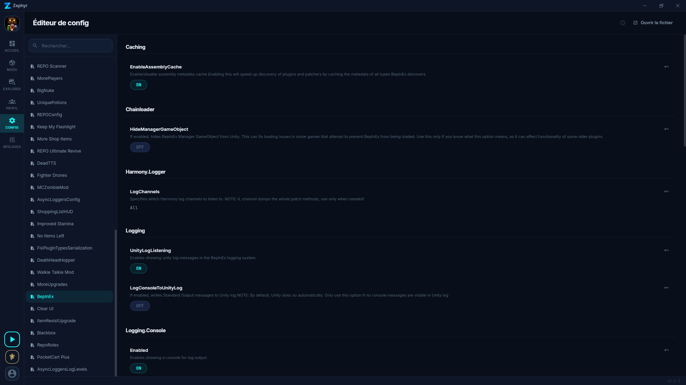

<p align="center">
  
</p>

<h1 align="center">Zephyr</h1>
<p align="center"><strong>A fast, modern mod manager for all your games</strong></p>
<p align="center">by <a href="https://prismo-studios.dev">Prismo Studio</a></p>

<p align="center">
  <a href="https://github.com/Prismo-Studio/Zephyr/releases/latest"></a>
  <a href="https://github.com/prismo-studio/zephyr/blob/main/LICENSE.md"></a>
  
</p>

---

## Screenshots

### Dashboard

Pick your game, see your profiles and stats at a glance.



### Browse

Search and install mods from Thunderstore and CurseForge in one place. Each mod shows a source badge so you always know where it comes from.



### Mods

Manage your installed mods with drag-and-drop reordering, batch actions, and detailed mod info with readme and changelogs.



### Config Editor

Edit BepInEx plugin configs directly from the app without digging through files.



## Features

- **Multi-game support** -- 198+ games from Thunderstore, including Lethal Company, R.E.P.O., and Risk of Rain 2
- **Thunderstore integration** -- Browse, install, and update mods directly from Thunderstore
- **Profile management** -- Create and switch between mod profiles for each game
- **Config editor** -- Edit mod configuration files with a built-in, structured editor
- **Custom themes** -- 4 built-in themes with full CSS custom property support
- **Multi-language support** -- Available in 7 languages
- **Fast Rust backend** -- Native performance powered by Tauri 2 and Rust

## Quick Start

### Download

Head to the [Releases](https://github.com/prismo-studio/zephyr/releases) page and grab the latest installer for your platform:

- **Windows** -- `.exe` (NSIS installer)
- **Linux** -- AppImage, `.deb`
- **macOS** -- `.dmg`

> **Note:** On Windows, you may see a SmartScreen prompt. Click "More Info" then "Run Anyway" to proceed.

### Build from Source

#### Prerequisites

- [Rust](https://rustup.rs/) (stable toolchain)
- [Node.js](https://nodejs.org/) 18+
- [pnpm](https://pnpm.io/)

#### Commands

```bash
git clone https://github.com/prismo-studio/zephyr.git
cd zephyr
pnpm install
pnpm tauri dev
```

To create a production build:

```bash
pnpm tauri build
```

## Tech Stack

| Layer     | Technology            |
| --------- | --------------------- |
| Framework | Tauri 2               |
| Frontend  | Svelte 5              |
| Backend   | Rust                  |
| Styling   | CSS Custom Properties |

## Fork Info

Zephyr is forked from [Gale](https://github.com/Kesomannen/gale) by [Kesomannen](https://github.com/Kesomannen).

## License

This project is licensed under [GPL-3.0](LICENSE.md).

Material icons are licensed under [Apache 2.0](https://www.apache.org/licenses/LICENSE-2.0.html).

## Credits

Built and maintained by [Prismo Studios](https://prismo-studios.dev).
